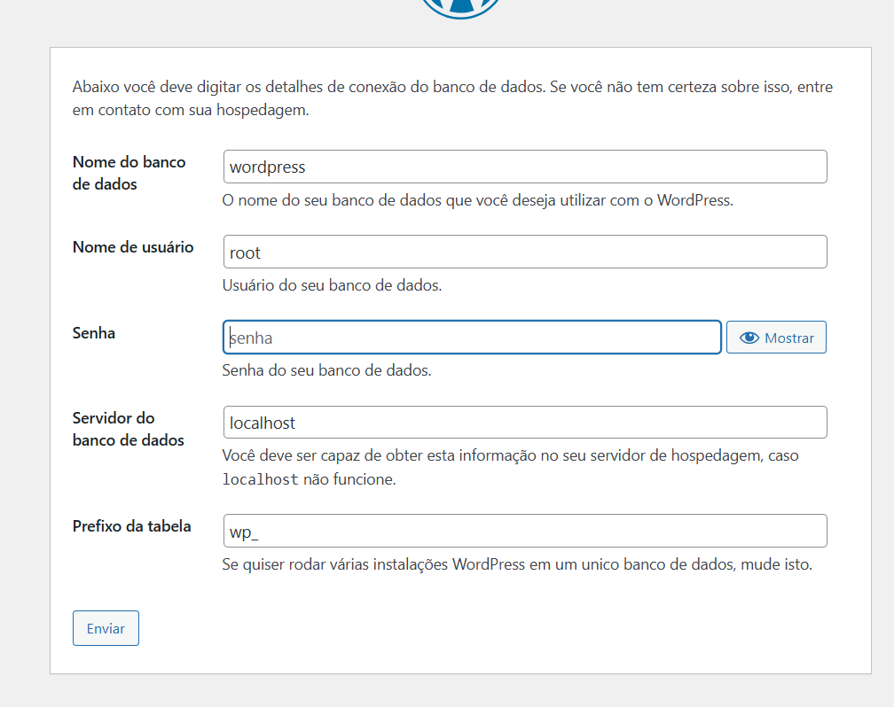
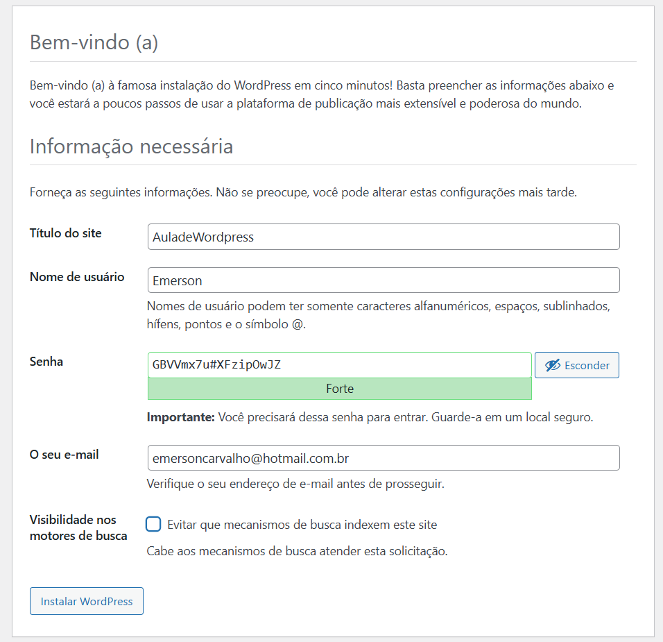
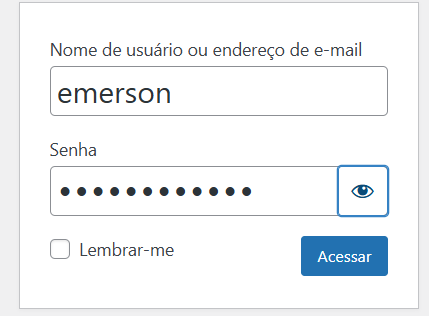
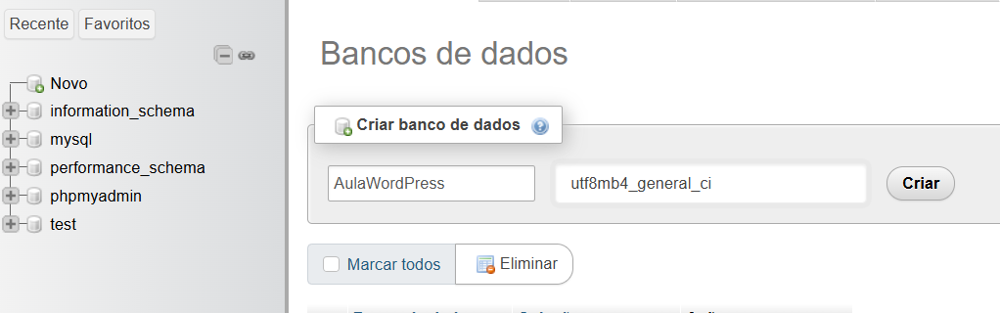

# Aula de WordPress

Baixar no site wordpress para poder usar.

https://br.wordpress.org/download/

Pegar o arquivo no do Wordpress baixado e extrair na pasta do htdocs.
Obs: manter o nome de wordpress.
C:\xampp\htdocs\wordpress

## Instalação do Wordpess

01. Executar o XAMPP, o Apache e o MySQL.

02. Abrir o navegador e digitar.
http://localhost/wordpress/

03. Fazer a criação do banco de dados, no próximo passo "Criar um banco".

04. Vai abri para instalação do wordpress

http://localhost/wordpress/wp-admin/setup-config.php

05. Manter o mesmo nome da criação do banco de dados.
- Nome do Banco de Dados: Wordpress
- Nome de Usuário: hoot
- Senha: em branco
- Servidor do banco de dados: localhost
- Prefixo da tabela: wp_

06. Clicar em Instalar.

07. Preencher as informações.
- Título do site: StreetWear
- Nome de usuário: Emerson
- Senha: *Emer1406Car
- O seu e-mail: emersoncarvalho@hotmail.com.br

08. Após finalizar a instalação, e clica em acessar.

09. Acessar o Site.

http://localhost/wordpress/wp-login.php

- Usuário Nome e E-mail: Emerson
- Senha:

10. Para abrir a página, vc colocar o localhost + o nome da página.

http://localhost/wordpress/

11. Para iniciar a instalação do Site, pode ir em POST.

## Depois pelo XAMP, iniciar o PHP e MYSQL.

Abrir o ADIM localhost do banco.

http://localhost/phpmyadmin/index.php?route=/server/databases

## Criar um banco.

01. Criar em NOVO para gerar um banco de dados. 
- Colocado um nome "WordPress", mesmo nome usado para o Wordpress.

02. 

# Plugins para Wordpress

- Compressor de imagem.

É para poder acertar e ajustar as imagens por tamanho.

Aplicativo.
Smush Image Optimization – Optimize Images | Compress & Lazy Load Images | Convert WebP & AVIF | Image CDN